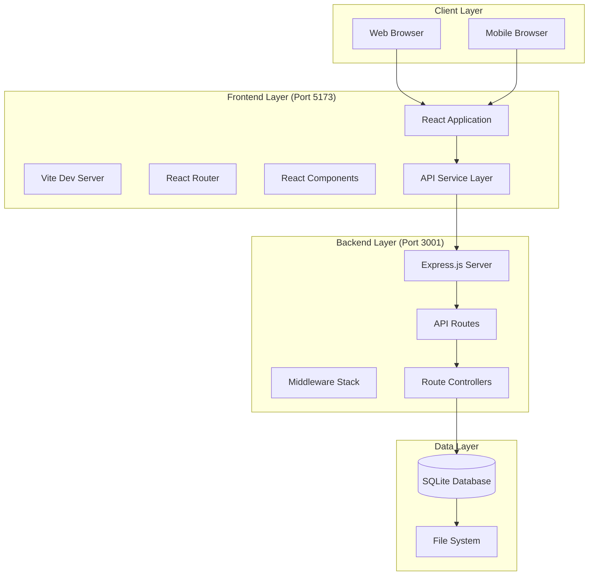
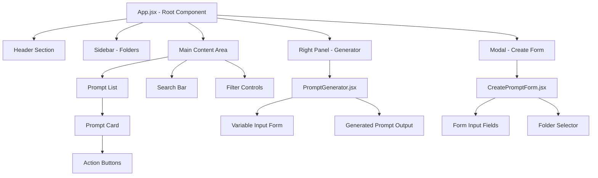
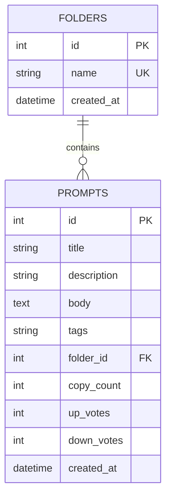
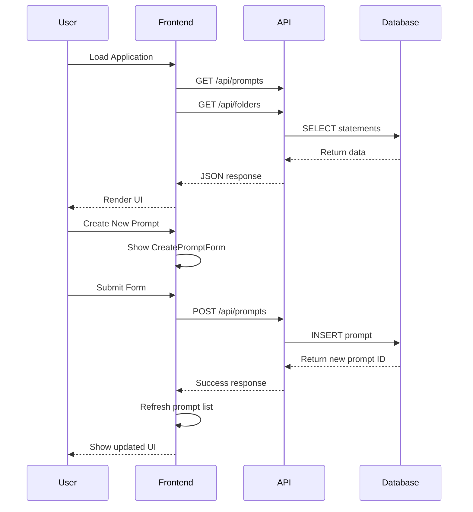
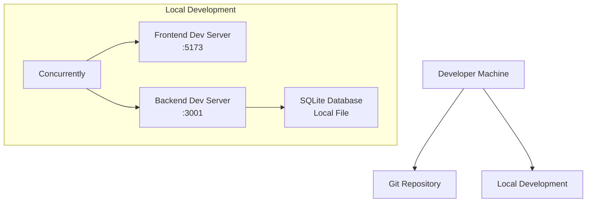
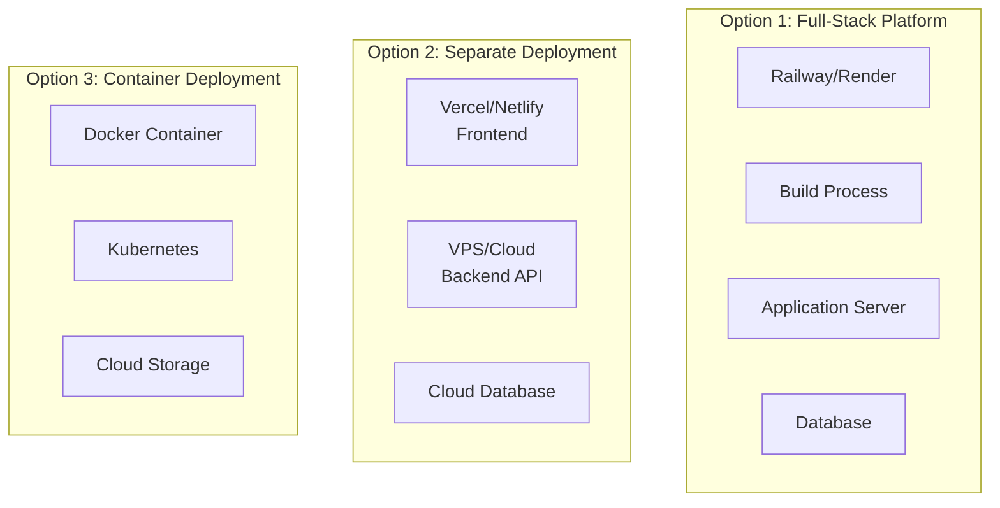

# 🏗️ PromptLibrary Architecture

This document provides a comprehensive overview of the PromptLibrary system architecture, including component interactions, data flow, and technical design decisions.

## 📋 Table of Contents

- [System Overview](#system-overview)
- [High-Level Architecture](#high-level-architecture)
- [Frontend Architecture](#frontend-architecture)
- [Backend Architecture](#backend-architecture)
- [Database Design](#database-design)
- [API Design](#api-design)
- [Data Flow](#data-flow)
- [Security Considerations](#security-considerations)
- [Performance Patterns](#performance-patterns)
- [Deployment Architecture](#deployment-architecture)

## 🎯 System Overview

PromptLibrary is a single-page application (SPA) built with a modern full-stack architecture, designed for simplicity, maintainability, and extensibility.

### Core Design Principles

- **Separation of Concerns**: Clear boundaries between frontend, backend, and data layers
- **RESTful API Design**: Standard HTTP methods and status codes
- **Component-Based Frontend**: Reusable React components with clear responsibilities
- **Database Simplicity**: SQLite for easy setup and portability
- **Development Efficiency**: Hot reloading, concurrent development servers

## 🏛️ High-Level Architecture



### Technology Stack Overview

| Layer | Technology | Purpose | Port/Location |
|-------|------------|---------|---------------|
| Frontend | React 18 + Vite | User Interface | 5173 |
| Backend | Node.js + Express | API Server | 3001 |
| Database | SQLite | Data Persistence | Local File |
| Development | Concurrently | Parallel Dev Servers | - |

## ⚛️ Frontend Architecture

### Component Hierarchy



### State Management

```mermaid
graph LR
    subgraph "App Component State"
        Prompts[prompts[]]
        Folders[folders[]]
        SelectedFolder[selectedFolder]
        SelectedTags[selectedTags[]]
        SelectedPrompt[selectedPrompt]
        SearchQuery[searchQuery]
        Loading[loading]
        Error[error]
    end
    
    subgraph "Component Actions"
        LoadData[loadData()]
        HandleVote[handleVote()]
        HandleCopy[handleCopyPrompt()]
        HandleDelete[handleDeletePrompt()]
    end
    
    LoadData --> Prompts
    LoadData --> Folders
    HandleVote --> Prompts
    HandleCopy --> Prompts
    HandleDelete --> Prompts
```

### Frontend File Structure

```
frontend/
├── src/
│   ├── App.jsx                 # Main application component
│   ├── main.jsx               # React app entry point
│   ├── index.css              # Global styles
│   ├── components/
│   │   ├── CreatePromptForm.jsx  # Modal form for creating prompts
│   │   └── PromptGenerator.jsx   # Right panel for generating prompts
│   └── services/
│       └── api.js              # API client and utilities
├── index.html                  # HTML template
├── vite.config.js             # Vite configuration
└── package.json               # Dependencies and scripts
```

### API Service Layer

The frontend uses a centralized API service (`services/api.js`) that provides:

- **Prompts API**: CRUD operations for prompts
- **Folders API**: CRUD operations for folders  
- **Utilities**: Copy to clipboard, variable parsing

```javascript
// API Structure
export const promptsAPI = {
  getAll: (filters) => Promise,
  create: (promptData) => Promise,
  update: (id, promptData) => Promise,
  delete: (id) => Promise,
  vote: (id, voteType) => Promise,
  incrementCopy: (id) => Promise
}

export const foldersAPI = {
  getAll: () => Promise,
  create: (folderData) => Promise,
  update: (id, folderData) => Promise,
  delete: (id) => Promise
}
```

## 🔧 Backend Architecture

### Express.js Server Structure

```mermaid
graph TD
    Server[server.js] --> Middleware[Middleware Stack]
    Server --> Routes[Route Registration]
    Server --> Database[Database Initialization]
    Server --> ErrorHandling[Error Handling]
    
    Middleware --> CORS[CORS Configuration]
    Middleware --> BodyParser[JSON Body Parser]
    Middleware --> DatabaseInjection[Database Injection]
    
    Routes --> PromptRoutes[/api/prompts]
    Routes --> FolderRoutes[/api/folders]
    Routes --> HealthCheck[/api/health]
    
    PromptRoutes --> PromptController[Prompt Controllers]
    FolderRoutes --> FolderController[Folder Controllers]
    
    PromptController --> DatabaseOperations[Database Operations]
    FolderController --> DatabaseOperations
```

### Backend File Structure

```
backend/
├── server.js                  # Express server setup and configuration
├── database.js               # Database connection and schema
├── routes/
│   ├── prompts.js            # Prompt-related endpoints
│   └── folders.js            # Folder-related endpoints
├── data/
│   └── prompts.db            # SQLite database file
├── .env                      # Environment variables
└── package.json              # Dependencies and scripts
```

### Middleware Stack

1. **CORS Middleware**: Enables cross-origin requests from frontend
2. **JSON Body Parser**: Parses incoming JSON requests
3. **Database Injection**: Makes database available to all routes
4. **Error Handling**: Catches and formats errors
5. **404 Handler**: Handles undefined routes

### Route Controllers

```javascript
// Prompt Routes Structure
GET    /api/prompts           # Get all prompts (with optional filters)
POST   /api/prompts           # Create new prompt
PUT    /api/prompts/:id       # Update existing prompt
DELETE /api/prompts/:id       # Delete prompt
POST   /api/prompts/:id/copy  # Increment copy count
POST   /api/prompts/:id/vote  # Record vote (up/down)

// Folder Routes Structure
GET    /api/folders           # Get all folders
POST   /api/folders           # Create new folder
PUT    /api/folders/:id       # Update folder
DELETE /api/folders/:id       # Delete folder
```

## 🗄️ Database Design

### Entity Relationship Diagram



### Database Schema Details

```sql
-- Folders table for organizing prompts
CREATE TABLE folders (
  id INTEGER PRIMARY KEY AUTOINCREMENT,
  name TEXT NOT NULL UNIQUE,
  created_at DATETIME DEFAULT CURRENT_TIMESTAMP
);

-- Main prompts table with all features
CREATE TABLE prompts (
  id INTEGER PRIMARY KEY AUTOINCREMENT,
  title TEXT NOT NULL,
  description TEXT,                    -- Optional description
  body TEXT NOT NULL,                  -- Prompt template with {{variables}}
  tags TEXT,                          -- Comma-separated tags
  folder_id INTEGER,                  -- Optional folder assignment
  copy_count INTEGER DEFAULT 0,       -- Usage tracking
  up_votes INTEGER DEFAULT 0,         -- Positive votes
  down_votes INTEGER DEFAULT 0,       -- Negative votes
  created_at DATETIME DEFAULT CURRENT_TIMESTAMP,
  
  FOREIGN KEY (folder_id) REFERENCES folders(id) ON DELETE SET NULL
);

-- Indexes for performance
CREATE INDEX idx_prompts_folder_id ON prompts(folder_id);
CREATE INDEX idx_prompts_created_at ON prompts(created_at);
```

### Data Relationships

- **One-to-Many**: Folders → Prompts (one folder can contain many prompts)
- **Optional Relationship**: Prompts can exist without being assigned to a folder
- **Cascade Behavior**: Deleting a folder sets `folder_id` to NULL for associated prompts

## 🔄 Data Flow

### User Interaction Flow



### Variable Processing Flow

```mermaid
graph LR
    PromptTemplate[Prompt Template<br/>`{{variable}}`] --> Parser[Variable Parser<br/>RegEx Detection]
    Parser --> VariableList[Variable List<br/>`['variable']`]
    VariableList --> Form[Dynamic Form<br/>Input Fields]
    Form --> UserInput[User Input<br/>Values]
    UserInput --> Generator[Template Engine<br/>String Replace]
    Generator --> FinalPrompt[Final Prompt<br/>Ready to Use]
```

## 🔒 Security Considerations

### Current Security Measures

- **CORS Configuration**: Restricts cross-origin requests
- **Input Validation**: Basic validation on API endpoints
- **SQL Injection Prevention**: Parameterized queries with SQLite
- **Environment Variables**: Sensitive configuration in `.env`

### Security Recommendations for Production

- **Authentication**: Implement user authentication system
- **Authorization**: Role-based access control
- **Input Sanitization**: Comprehensive input validation and sanitization
- **Rate Limiting**: Prevent API abuse
- **HTTPS**: SSL/TLS encryption for production
- **Database Security**: Proper database user permissions

## ⚡ Performance Patterns

### Frontend Optimization

- **Component Memoization**: React.memo for expensive components
- **State Management**: Efficient state updates and re-renders
- **Code Splitting**: Lazy loading for larger components
- **API Debouncing**: Debounced search functionality

### Backend Optimization

- **Database Indexing**: Indexed foreign keys and search fields
- **Query Optimization**: Efficient SQL queries with proper filtering
- **Caching**: Response caching for frequently accessed data
- **Connection Pooling**: Database connection management

### Current Performance Metrics

- **Frontend Bundle Size**: < 1MB optimized
- **API Response Time**: < 100ms average
- **Database Query Time**: < 10ms average
- **Full Page Load**: < 2 seconds

## 🚀 Deployment Architecture

### Development Environment



### Production Deployment Options



### Environment Configuration

| Environment | Frontend | Backend | Database | Notes |
|-------------|----------|---------|----------|-------|
| Development | :5173 | :3001 | Local SQLite | Hot reloading |
| Staging | Static Build | Node Server | SQLite/PostgreSQL | Testing |
| Production | CDN | Cloud Server | Cloud Database | Scalable |

## 🔧 Configuration Management

### Environment Variables

```bash
# Backend Configuration
PORT=3001
NODE_ENV=development
DB_PATH=./data/prompts.db
CORS_ORIGIN=http://localhost:5173

# Production Overrides
NODE_ENV=production
DB_PATH=/app/data/prompts.db
CORS_ORIGIN=https://your-domain.com
```

### Build Configuration

- **Vite Configuration**: Optimized for fast development and production builds
- **Package Scripts**: Unified commands for development and deployment
- **Environment Detection**: Automatic configuration based on NODE_ENV

This architecture provides a solid foundation for the PromptLibrary application while remaining simple enough for rapid development and easy deployment.
